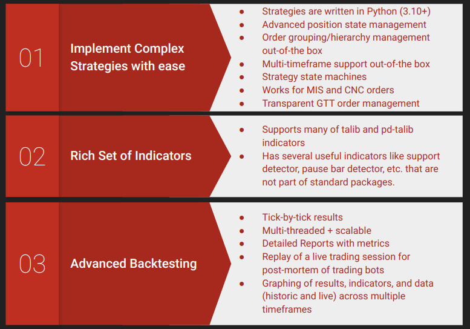
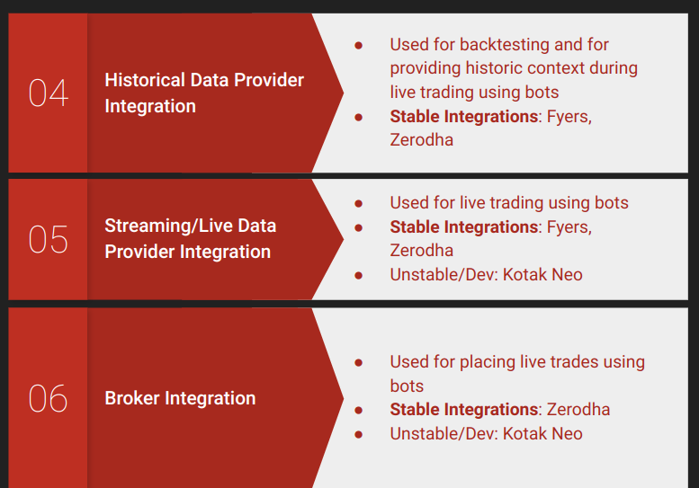
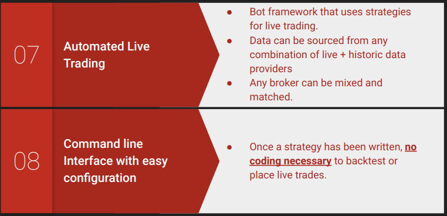
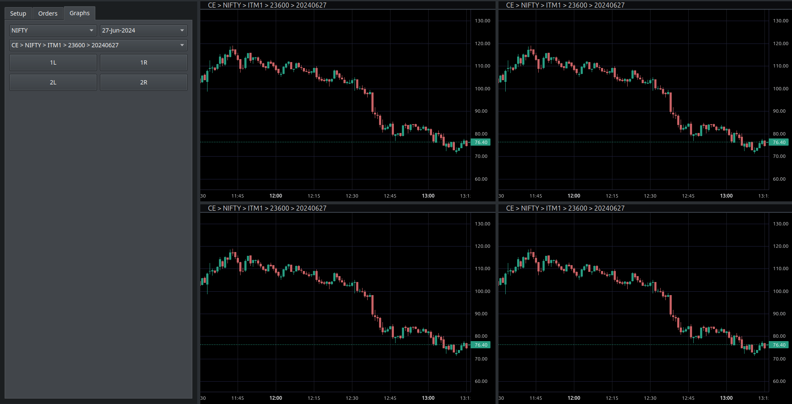
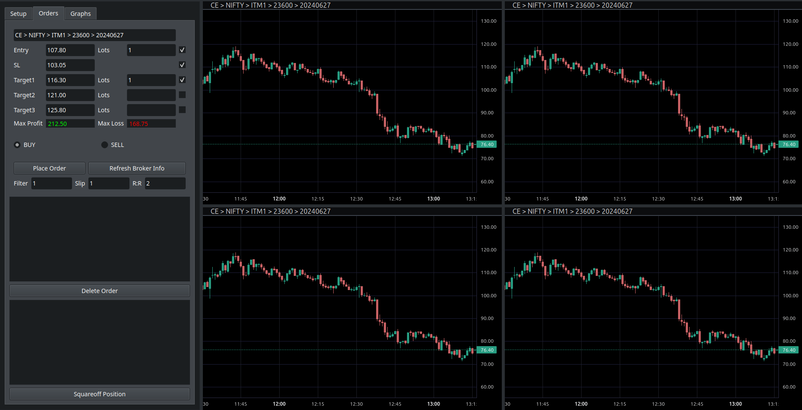
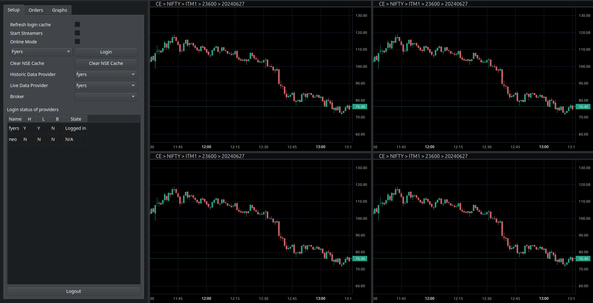

# QuaintTrade
Trading and Backtesting Platform v0.5

## License and Disclaimers

<p xmlns:cc="http://creativecommons.org/ns#" xmlns:dct="http://purl.org/dc/terms/"><a property="dct:title" rel="cc:attributionURL" href="https://github.com/quaintscience/quaintrade">QuainTrade</a> by <span property="cc:attributionName">Gokul Thattaguppa Chittaranjan</span> is licensed under <a href="https://creativecommons.org/licenses/by-nc-sa/4.0/?ref=chooser-v1" target="_blank" rel="license noopener noreferrer" style="display:inline-block;">CC BY-NC-SA 4.0</a></p>

I would like this platform to be improved and used by others but for personal use.
Any larger commercial usage, please contact me. I would like to use such opportunities of fund its further development.

Warning:
THIS SOFTWARE IS PROVIDED BY THE AUTHOR ``AS IS'' AND ANY  EXPRESS OR IMPLIED WARRANTIES, INCLUDING, BUT NOT LIMITED TO, THE IMPLIED WARRANTIES OF MERCHANTABILITY AND FITNESS FOR A PARTICULAR PURPOSE ARE DISCLAIMED. IN NO EVENT SHALL THE AUTHOR BE LIABLE FOR ANY DIRECT, INDIRECT, INCIDENTAL, SPECIAL, EXEMPLARY, OR CONSEQUENTIAL DAMAGES (INCLUDING, BUT NOT LIMITED TO, PROCUREMENT OF SUBSTITUTE GOODS OR SERVICES; LOSS OF USE, DATA, OR PROFITS; OR BUSINESS INTERRUPTION) HOWEVER CAUSED AND ON ANY THEORY OF LIABILITY, WHETHER IN CONTRACT, STRICT LIABILITY, OR TORT (INCLUDING NEGLIGENCE OR OTHERWISE) ARISING IN ANY WAY OUT OF THE USE OF THIS SOFTWARE, EVEN IF ADVISED OF THE POSSIBILITY OF SUCH DAMAGE.

Trading is a risky activity. No part of this code or work should be construed as investment advice and neither am I a licensed consultant to be selling you any financial advice.

Written by Gokul Thattaguppa Chittaranjan <gokul@quaintscience.com>, 01-11-2023

*Please contact us at gokul@quaintscience.com for automated backtesting of strategies or for any consulting related to this product - such as tooling for scalping, data analysis, etc.*


## Features

- Backtesting framework
- Broker integrations:
    - Kotak Neo (Broker, Live Data)
    - Fyers (Live Data, Historic Data)
    - Zerodha (Live Data, Historic Data, Broker)
- Out of the box GTT/BO support (even if the broker doesn't support it)
- Backtesting mimics stock market -- algorithms needn't be "vector driven" like pinescript. 
- Replay of forward testing tick by tick
- Automated placement of order using Bots
- A work in progress (incomplete) Qt5 interface to do scalping and viewing graphs using Tradingview's lightweight charts
- Graphing support with matplotlib + mlpfinance
- CLI interface for linux





###Screenshots of the work-in-progress scalper






## Installation

This is an alpha release made in haste. So the installation is simple, but lengthy.

Step-1: Clone the repo into `quaintrade/` and `cd` into it.

Step-2: Please install the fork of kotak neo created at:
https://github.com/QuaintScience/kotak-neo-api
[Needed to save yourself the pain of entering OTP every login within 24 hours]

Step-3: Please install the fork of lightweight charts at:
https://github.com/QuaintScience/lightweight-charts-python
[Needed to get OHLC data from candles upon click when using the scalping tool]


Step-3: Setting up the environment
```
$ python -m venv venv
$ . setup-env.sh
$ pip install pybuilder
$ ./pyb quaintrade

... yada yada

quaintrade-1.0.dev/setup.py
[INFO]  Building binary distribution in /code/github/finance/quaintrade/quaintrade/target/dist/quaintrade-1.0.dev
[INFO]  Running Twine check for generated artifacts
------------------------------------------------------------
BUILD SUCCESSFUL
------------------------------------------------------------
Build Summary
             Project: quaintrade
             Version: 1.0.dev (1.0.dev20240627165151)
      Base directory: /code/github/finance/quaintrade/quaintrade
        Environments: 
               Tasks: prepare [161003 ms] install_dependencies [3900 ms] compile_sources [0 ms] run_unit_tests [215 ms] analyze [19821 ms] package [53 ms] run_integration_tests [0 ms] verify [0 ms] publish [970 ms]
Build finished at 2024-06-27 22:24:57
Build took 186 seconds (186359 ms)

$ cd ..
$ wget https://prdownloads.sourceforge.net/ta-lib/ta-lib-0.4.0-src.tar.gz
$ tar-xzvf ta-lib-0.4.0-src.tar.gz
$ cd ta-lib
$ ./configure
$ make
$ sudo make install
$ cd ..
$ cd quaintrade
$ cp quaintrade/src/main/scripts/* venv/bin/
$ git clone https://github.com/QuaintScience/ta-lib-python.git
$ cd ta-lib-python
$ python setup.py build sdist
$ cd dist
$ pip install ta_lib-0.4.31.tar.gz
$ cd ../..
$ cd quaintrade
```

## Installing/Running the scalper UI

### Installation
```
$ pip install pyqtwebengine
$ pip install pyqt-toast-notification
```

### Starting the UI

```
$ python quaintrade/src/main/python/quaintscience/trader/ui/scalper.py
```

## Command line tools

After the installation, you should have access to the following command line tools

- `qtrade-get-historic-data`

```
usage: qtrade-get-historic-data [-h] [--data_path DATA_PATH]
                                [--data_provider_class DATAPROVIDERCLASS]
                                [--data_provider_login] [--data_provider_init]
                                [--data_provider_reset_auth_cache]
                                [--storage_class STORAGECLASS]
                                [--data_provider_auth_credentials DATA_PROVIDER_AUTH_CREDENTIALS]
                                [--data_provider_auth_cache_filepath DATA_PROVIDER_AUTH_CACHE_FILEPATH]
                                [--data_provider_custom_kwargs DATA_PROVIDER_CUSTOM_KWARGS]
                                [--instruments INSTRUMENTS]
                                [--from_date FROM_DATE] [--to_date TO_DATE]

options:
  -h, --help            show this help message and exit
  --data_path DATA_PATH
                        Data cache path [env var: DATA_PATH]
  --data_provider_class DATAPROVIDERCLASS
                        Provider Class [env var: DATA_PROVIDER_CLASS]
  --data_provider_login
                        Data provider login needed [env var:
                        DATA_PROVIDER_LOGIN_NEEDED]
  --data_provider_init  Do data provider init [env var:
                        DATA_PROVIDER_INIT_NEEDED]
  --data_provider_reset_auth_cache
                        Reset data provider auth cache [env var:
                        DATA_PROVIDER_RESET_AUTH_CACHE]
  --storage_class STORAGECLASS
                        Storage class [env var: STORAGE_CLASS]
  --data_provider_auth_credentials DATA_PROVIDER_AUTH_CREDENTIALS
                        Data provider auth Credentials [env var:
                        DATA_PROVIDER_AUTH_CREDENTIALS]
  --data_provider_auth_cache_filepath DATA_PROVIDER_AUTH_CACHE_FILEPATH
                        Data provider auth cache filepath [env var:
                        DATA_PROVIDER_AUTH_CACHE_FILEPATH]
  --data_provider_custom_kwargs DATA_PROVIDER_CUSTOM_KWARGS
                        Data provider custom kwargs [env var:
                        DATA_PROVIDER_CUSTOM_KWARGS]
  --instruments INSTRUMENTS
                        Instruments [env var: INSTRUMENTS]
  --from_date FROM_DATE
                        From date [env var: FROM_DATE]
  --to_date TO_DATE     To date [env var: TO_DATE]

Args that start with '--' can also be set in a config file
(.historic.trader.env). The config file uses YAML syntax and must represent a
YAML 'mapping' (for details, see http://learn.getgrav.org/advanced/yaml). In
general, command-line values override environment variables which override config
file values which override defaults.
```

- `qtrade-get-live-data`

```usage: qtrade-get-live-data [-h] [--data_path DATA_PATH]
                            [--data_provider_class DATAPROVIDERCLASS]
                            [--data_provider_login] [--data_provider_init]
                            [--data_provider_reset_auth_cache]
                            [--storage_class STORAGECLASS]
                            [--data_provider_auth_credentials DATA_PROVIDER_AUTH_CREDENTIALS]
                            [--data_provider_auth_cache_filepath DATA_PROVIDER_AUTH_CACHE_FILEPATH]
                            [--data_provider_custom_kwargs DATA_PROVIDER_CUSTOM_KWARGS]
                            [--instruments INSTRUMENTS] [--clear_live_data_cache]

options:
  -h, --help            show this help message and exit
  --data_path DATA_PATH
                        Data cache path [env var: DATA_PATH]
  --data_provider_class DATAPROVIDERCLASS
                        Provider Class [env var: DATA_PROVIDER_CLASS]
  --data_provider_login
                        Data provider login needed [env var:
                        DATA_PROVIDER_LOGIN_NEEDED]
  --data_provider_init  Do data provider init [env var:
                        DATA_PROVIDER_INIT_NEEDED]
  --data_provider_reset_auth_cache
                        Reset data provider auth cache [env var:
                        DATA_PROVIDER_RESET_AUTH_CACHE]
  --storage_class STORAGECLASS
                        Storage class [env var: STORAGE_CLASS]
  --data_provider_auth_credentials DATA_PROVIDER_AUTH_CREDENTIALS
                        Data provider auth Credentials [env var:
                        DATA_PROVIDER_AUTH_CREDENTIALS]
  --data_provider_auth_cache_filepath DATA_PROVIDER_AUTH_CACHE_FILEPATH
                        Data provider auth cache filepath [env var:
                        DATA_PROVIDER_AUTH_CACHE_FILEPATH]
  --data_provider_custom_kwargs DATA_PROVIDER_CUSTOM_KWARGS
                        Data provider custom kwargs [env var:
                        DATA_PROVIDER_CUSTOM_KWARGS]
  --instruments INSTRUMENTS
                        Instruments [env var: INSTRUMENTS]
  --clear_live_data_cache
                        Clear live data cache before starting [env var:
                        CLEAR_LIVE_DATA_CACHE]

Args that start with '--' can also be set in a config file (.live.trader.env).
The config file uses YAML syntax and must represent a YAML 'mapping' (for
details, see http://learn.getgrav.org/advanced/yaml). In general, command-line
values override environment variables which override config file values which
override defaults.
```

- qtrade-backtest

```
usage: qtrade-backtest [-h] [--broker_class BROKERCLASS] [--broker_login]
                       [--broker_init] [--broker_skip_order_streamer]
                       [--broker_thread_id BROKER_THREAD_ID]
                       [--broker_audit_records_path BROKER_AUDIT_RECORDS_PATH]
                       [--broker_reset_auth_cache]
                       [--broker_auth_credentials BROKER_AUTH_CREDENTIALS]
                       [--broker_auth_cache_filepath BROKER_AUTH_CACHE_FILEPATH]
                       [--broker_custom_kwargs BROKER_CUSTOM_KWARGS]
                       [--data_path DATA_PATH]
                       [--data_provider_class DATAPROVIDERCLASS]
                       [--data_provider_login] [--data_provider_init]
                       [--data_provider_reset_auth_cache]
                       [--storage_class STORAGECLASS]
                       [--data_provider_auth_credentials DATA_PROVIDER_AUTH_CREDENTIALS]
                       [--data_provider_auth_cache_filepath DATA_PROVIDER_AUTH_CACHE_FILEPATH]
                       [--data_provider_custom_kwargs DATA_PROVIDER_CUSTOM_KWARGS]
                       [--instruments INSTRUMENTS]
                       [--strategy_class STRATEGYCLASS]
                       [--bot_live_data_context_size BOT_LIVE_DATA_CONTEXT_SIZE]
                       [--bot_backtesting_print_tables] [--bot_online_mode]
                       [--strategy_kwargs STRATEGY_KWARGS]
                       [--bot_custom_kwargs BOT_CUSTOM_KWARGS]
                       [--from_date FROM_DATE] [--to_date TO_DATE]
                       [--context_from_date CONTEXT_FROM_DATE]
                       [--interval INTERVAL]
                       [--refresh_orders_immediately_on_gtt_state_change REFRESH_ORDERS_IMMEDIATELY_ON_GTT_STATE_CHANGE]
                       [--plot_results] [--window_size WINDOW_SIZE]
                       [--live_trading_mode]
                       [--clear_tradebook_for_scrip_and_exchange]

options:
  -h, --help            show this help message and exit
  --broker_class BROKERCLASS
                        Broker Class [env var: BROKER_CLASS]
  --broker_login        Broker Login needed [env var: BROKER_LOGIN_NEEDED]
  --broker_init         Do broker init [env var: BROKER_INIT_NEEDED]
  --broker_skip_order_streamer
                        Do not start order streamer (to listen to order change)
                        [env var: BROKER_SKIP_ORDER_STREAMER]
  --broker_thread_id BROKER_THREAD_ID
                        Thread ID of broker (To store separate tradebooks) [env
                        var: BROKER_THREAD_ID]
  --broker_audit_records_path BROKER_AUDIT_RECORDS_PATH
                        Path to store broker audit records [env var:
                        BROKER_AUDIT_RECORDS_PATH]
  --broker_reset_auth_cache
                        Reset broker auth cache [env var:
                        BROKER_RESET_AUTH_CACHE]
  --broker_auth_credentials BROKER_AUTH_CREDENTIALS
                        Broker auth Credentials [env var:
                        BROKER_AUTH_CREDENTIALS]
  --broker_auth_cache_filepath BROKER_AUTH_CACHE_FILEPATH
                        Broker auth credentials cache filepath [env var:
                        BROKER_AUTH_CACHE_FILEPATH]
  --broker_custom_kwargs BROKER_CUSTOM_KWARGS
                        Broker custom kwargs [env var: BROKER_CUSTOM_KWARGS]
  --data_path DATA_PATH
                        Data cache path [env var: DATA_PATH]
  --data_provider_class DATAPROVIDERCLASS
                        Provider Class [env var: DATA_PROVIDER_CLASS]
  --data_provider_login
                        Data provider login needed [env var:
                        DATA_PROVIDER_LOGIN_NEEDED]
  --data_provider_init  Do data provider init [env var:
                        DATA_PROVIDER_INIT_NEEDED]
  --data_provider_reset_auth_cache
                        Reset data provider auth cache [env var:
                        DATA_PROVIDER_RESET_AUTH_CACHE]
  --storage_class STORAGECLASS
                        Storage class [env var: STORAGE_CLASS]
  --data_provider_auth_credentials DATA_PROVIDER_AUTH_CREDENTIALS
                        Data provider auth Credentials [env var:
                        DATA_PROVIDER_AUTH_CREDENTIALS]
  --data_provider_auth_cache_filepath DATA_PROVIDER_AUTH_CACHE_FILEPATH
                        Data provider auth cache filepath [env var:
                        DATA_PROVIDER_AUTH_CACHE_FILEPATH]
  --data_provider_custom_kwargs DATA_PROVIDER_CUSTOM_KWARGS
                        Data provider custom kwargs [env var:
                        DATA_PROVIDER_CUSTOM_KWARGS]
  --instruments INSTRUMENTS
                        Instruments [env var: INSTRUMENTS]
  --strategy_class STRATEGYCLASS
                        strategy to use [env var: STRATEGY_CLASS]
  --bot_live_data_context_size BOT_LIVE_DATA_CONTEXT_SIZE
                        Live trading context size [env var:
                        BOT_LIVE_DATA_CONTEXT_SIZE]
  --bot_backtesting_print_tables
                        Print tables for every tick in backtesting [env var:
                        BOT_BACKTESTING_PRINT_TABLES]
  --bot_online_mode     Run bot in online mode (get data during live trading)
                        [env var: BOT_ONLINE_MODE]
  --strategy_kwargs STRATEGY_KWARGS
                        kwargs to instantiate the strategy [env var:
                        STRATEGY_KWARGS]
  --bot_custom_kwargs BOT_CUSTOM_KWARGS
                        kwargs to instantiate the bot [env var:
                        BOT_CUSTOM_KWARGS]
  --from_date FROM_DATE
                        From date [env var: FROM_DATE]
  --to_date TO_DATE     To date [env var: TO_DATE]
  --context_from_date CONTEXT_FROM_DATE
                        context from date [env var: CONTEXT_FROM_DATE]
  --interval INTERVAL   To date [env var: INTERVAL]
  --refresh_orders_immediately_on_gtt_state_change REFRESH_ORDERS_IMMEDIATELY_ON_GTT_STATE_CHANGE
                        Refresh orders when gtt orders are executed [env var:
                        REFRESH_UPON_GTT_ORDERS]
  --plot_results        Plot backtesting results [env var: PLOT_RESULTS]
  --window_size WINDOW_SIZE
                        Window size to be passed into backtesting function [env
                        var: WINDOW_SIZE]
  --live_trading_mode   Run bot in live mode with paper broker [env var:
                        LIVE_TRADING_MODE]
  --clear_tradebook_for_scrip_and_exchange
                        Clear tradebook for scrip and exchange [env var:
                        CLEAR_TRADEBOOK_FOR_SCRIP_AND_EXCHANGE]

Args that start with '--' can also be set in a config file
(.backtesting.trader.env). The config file uses YAML syntax and must represent a
YAML 'mapping' (for details, see http://learn.getgrav.org/advanced/yaml). In
general, command-line values override environment variables which override config
file values which override defaults.
```

- `qtrade-live-trade`

```
usage: qtrade-live-trade [-h] [--broker_class BROKERCLASS] [--broker_login]
                         [--broker_init] [--broker_skip_order_streamer]
                         [--broker_thread_id BROKER_THREAD_ID]
                         [--broker_audit_records_path BROKER_AUDIT_RECORDS_PATH]
                         [--broker_reset_auth_cache]
                         [--broker_auth_credentials BROKER_AUTH_CREDENTIALS]
                         [--broker_auth_cache_filepath BROKER_AUTH_CACHE_FILEPATH]
                         [--broker_custom_kwargs BROKER_CUSTOM_KWARGS]
                         [--data_path DATA_PATH]
                         [--data_provider_class DATAPROVIDERCLASS]
                         [--data_provider_login] [--data_provider_init]
                         [--data_provider_reset_auth_cache]
                         [--storage_class STORAGECLASS]
                         [--data_provider_auth_credentials DATA_PROVIDER_AUTH_CREDENTIALS]
                         [--data_provider_auth_cache_filepath DATA_PROVIDER_AUTH_CACHE_FILEPATH]
                         [--data_provider_custom_kwargs DATA_PROVIDER_CUSTOM_KWARGS]
                         [--instruments INSTRUMENTS]
                         [--strategy_class STRATEGYCLASS]
                         [--bot_live_data_context_size BOT_LIVE_DATA_CONTEXT_SIZE]
                         [--bot_backtesting_print_tables] [--bot_online_mode]
                         [--strategy_kwargs STRATEGY_KWARGS]
                         [--bot_custom_kwargs BOT_CUSTOM_KWARGS]
                         [--interval INTERVAL]
                         [--clear_tradebook_for_scrip_and_exchange]

options:
  -h, --help            show this help message and exit
  --broker_class BROKERCLASS
                        Broker Class [env var: BROKER_CLASS]
  --broker_login        Broker Login needed [env var: BROKER_LOGIN_NEEDED]
  --broker_init         Do broker init [env var: BROKER_INIT_NEEDED]
  --broker_skip_order_streamer
                        Do not start order streamer (to listen to order change)
                        [env var: BROKER_SKIP_ORDER_STREAMER]
  --broker_thread_id BROKER_THREAD_ID
                        Thread ID of broker (To store separate tradebooks) [env
                        var: BROKER_THREAD_ID]
  --broker_audit_records_path BROKER_AUDIT_RECORDS_PATH
                        Path to store broker audit records [env var:
                        BROKER_AUDIT_RECORDS_PATH]
  --broker_reset_auth_cache
                        Reset broker auth cache [env var:
                        BROKER_RESET_AUTH_CACHE]
  --broker_auth_credentials BROKER_AUTH_CREDENTIALS
                        Broker auth Credentials [env var:
                        BROKER_AUTH_CREDENTIALS]
  --broker_auth_cache_filepath BROKER_AUTH_CACHE_FILEPATH
                        Broker auth credentials cache filepath [env var:
                        BROKER_AUTH_CACHE_FILEPATH]
  --broker_custom_kwargs BROKER_CUSTOM_KWARGS
                        Broker custom kwargs [env var: BROKER_CUSTOM_KWARGS]
  --data_path DATA_PATH
                        Data cache path [env var: DATA_PATH]
  --data_provider_class DATAPROVIDERCLASS
                        Provider Class [env var: DATA_PROVIDER_CLASS]
  --data_provider_login
                        Data provider login needed [env var:
                        DATA_PROVIDER_LOGIN_NEEDED]
  --data_provider_init  Do data provider init [env var:
                        DATA_PROVIDER_INIT_NEEDED]
  --data_provider_reset_auth_cache
                        Reset data provider auth cache [env var:
                        DATA_PROVIDER_RESET_AUTH_CACHE]
  --storage_class STORAGECLASS
                        Storage class [env var: STORAGE_CLASS]
  --data_provider_auth_credentials DATA_PROVIDER_AUTH_CREDENTIALS
                        Data provider auth Credentials [env var:
                        DATA_PROVIDER_AUTH_CREDENTIALS]
  --data_provider_auth_cache_filepath DATA_PROVIDER_AUTH_CACHE_FILEPATH
                        Data provider auth cache filepath [env var:
                        DATA_PROVIDER_AUTH_CACHE_FILEPATH]
  --data_provider_custom_kwargs DATA_PROVIDER_CUSTOM_KWARGS
                        Data provider custom kwargs [env var:
                        DATA_PROVIDER_CUSTOM_KWARGS]
  --instruments INSTRUMENTS
                        Instruments [env var: INSTRUMENTS]
  --strategy_class STRATEGYCLASS
                        strategy to use [env var: STRATEGY_CLASS]
  --bot_live_data_context_size BOT_LIVE_DATA_CONTEXT_SIZE
                        Live trading context size [env var:
                        BOT_LIVE_DATA_CONTEXT_SIZE]
  --bot_backtesting_print_tables
                        Print tables for every tick in backtesting [env var:
                        BOT_BACKTESTING_PRINT_TABLES]
  --bot_online_mode     Run bot in online mode (get data during live trading)
                        [env var: BOT_ONLINE_MODE]
  --strategy_kwargs STRATEGY_KWARGS
                        kwargs to instantiate the strategy [env var:
                        STRATEGY_KWARGS]
  --bot_custom_kwargs BOT_CUSTOM_KWARGS
                        kwargs to instantiate the bot [env var:
                        BOT_CUSTOM_KWARGS]
  --interval INTERVAL   To date [env var: INTERVAL]
  --clear_tradebook_for_scrip_and_exchange
                        Clear tradebook for scrip and exchange [env var:
                        CLEAR_TRADEBOOK_FOR_SCRIP_AND_EXCHANGE]

Args that start with '--' can also be set in a config file
(.livetrading.trader.env). The config file uses YAML syntax and must represent a
YAML 'mapping' (for details, see http://learn.getgrav.org/advanced/yaml). In
general, command-line values override environment variables which override config
file values which override defaults.
```

### Backtesting reports

By extending and implementing `quaintscience.trader.core.strategy.Strategy` and using `qtrade-backtest`, you can get a report that looks like this:

```order_id 			entry_time       exit_time                 pnl
--------------------------------  -------------------  -------------------  -------------------  --------
9ab00b7322103fca8e  2023-05-09 10:14:00  2023-05-09 15:01:00  TransactionType.BUY    461.53
10886f2ee1c895853e  2023-05-10 11:06:00  2023-05-10 15:01:00  TransactionType.BUY    176.23
ff85b8be20bddae881  2023-05-29 10:39:00  2023-05-29 15:01:00  TransactionType.BUY  -1021.89

Found 3 trades.
Accuracy: 0.6666666666666666
Max Drawdown: -1021.8900000000046
Lowest point: -384.1300000000183
Longest Loss Streak: 1
Longest Profit Streak: 2
Final Pnl: -384.1300000000183
Largest loss: -1021.8900000000046
```

It also gives you tick-by-tick results like this:

```╔═════════════════════╦═══════════╦═════════════╦═════════════╗
║ Time                ║   Pending ║   Completed ║   Cancelled ║
╠═════════════════════╬═══════════╬═════════════╬═════════════╣
║ 2023-05-30 15:28:00 ║         0 ║           6 ║          41 ║
╚═════════════════════╩═══════════╩═════════════╩═════════════╝
╔═══════╦══════╦══════════╦════════════╦═════════╦════════════╦══════════════════════╦═══════╦════════════════════╦═══════════════╦══════════════════════════╗
║ Typ   ║ id   ║ parent   ║ group_id   ║ scrip   ║ exchange   ║ buy/sell             ║   qty ║ order_type         ║   limit_price ║ reason                   ║
╠═══════╬══════╬══════════╬════════════╬═════════╬════════════╬══════════════════════╬═══════╬════════════════════╬═══════════════╬══════════════════════════╣
║ R     ║ 0a27 ║          ║            ║ TCS     ║ NSE        ║ TransactionType.BUY  ║    50 ║ OrderType.SL_LIMIT ║       3230.2  ║ entry, Strategy2_long    ║
║ GTT   ║ ad2a ║ 0a27     ║            ║ TCS     ║ NSE        ║ TransactionType.SELL ║    50 ║ OrderType.SL_LIMIT ║       3180    ║ stoploss, Strategy2_long ║
║ GTT   ║ 2dbb ║ 0a27     ║            ║ TCS     ║ NSE        ║ TransactionType.SELL ║    50 ║ OrderType.LIMIT    ║       5834.89 ║ target, Strategy2_long   ║
╚═══════╩══════╩══════════╩════════════╩═════════╩════════════╩══════════════════════╩═══════╩════════════════════╩═══════════════╩══════════════════════════╝
╔═════════════════════╦═════════╦════════════╦═══════╦════════╦═════════╦═════════╦════════╗
║ time                ║ scrip   ║ exchange   ║   qty ║   avgP ║     LTP ║     PnL ║   Comm ║
╠═════════════════════╬═════════╬════════════╬═══════╬════════╬═════════╬═════════╬════════╣
║ 2023-05-30 15:28:00 ║ TCS     ║ NSE        ║     0 ║      0 ║ 3316.15 ║ -384.13 ║ 304.13 ║
╚═════════════════════╩═════════╩════════════╩═══════╩════════╩═════════╩═════════╩════════╝
```

### Example YAML definitions that can be used with CLI

#### Live bot

```
Live Trading Bot
# storage type
storage_class: quaintscience.trader.core.perisistance.sqlite.ohlc.SqliteOHLCStorage

# common vars for all providers
data_path: data/
data_provider_auth_cache_filepath: auth_cache/

# fyers integration
data_provider_class: quaintscience.trader.integration.fyers.FyersHistoricDataProvider
data_provider_auth_credentials:
   REDIRECT_URI: "http://127.0.0.1:9595/fyers"
   CLIENT_ID: "XXXXXX"
   SECRET_KEY: "XXXXXXX"
data_provider_login: true
data_provider_init: true

# Strategy related parameters
strategy_class: quaintscience.trader.strategies.hiekinashiv2.HiekinAshiStrategyV2
bot_live_data_context_size: 60
window_size: 5
interval: "5min"
clear_tradebook_for_scrip_and_exchange: true
strategy_kwargs:
   max_budget: 1000
   min_quantity: 1

broker_class: quaintscience.trader.integration.kite.KiteBroker
broker_auth_credentials:
   API_KEY: XXXXXXXXXXXXXXX
   API_SECRET: XXXXXXXXXXXXXXXXXX
   ACCESS_TOKEN: null
   REQUEST_TOKEN: XXXXXXXXXXXXXXXXX

broker_audit_records_path: "broker_audit_live/"
broker_thread_id: "live_test"
broker_login: true
broker_init: true
broker_auth_cache_filepath: "auth_cache/"


```

#### Backtest

```
# storage type
storage_class: quaintscience.trader.core.perisistance.sqlite.ohlc.SqliteOHLCStorage

# common vars for all providers
data_path: data/
data_provider_auth_cache_filepath: auth_cache/

# kite integration
data_provider_class: quaintscience.trader.integration.fyers.FyersHistoricDataProvider
data_provider_auth_credentials:
   REDIRECT_URI: "http://127.0.0.1:9595/fyers"
   CLIENT_ID: "XXXXXXX"
   SECRET_KEY: "XXXXXXX"

# strategy settings
strategy_class: quaintscience.trader.strategies.strategy2.Strategy2

bot_live_data_context_size: 60
window_size: 20
strategy_kwargs:
   max_budget: 50000
   min_quantity: 50

```

#### Live Data Provider

```
# storage type
storage_class: quaintscience.trader.core.perisistance.sqlite.ohlc.SqliteOHLCStorage

# for live ohlc plotter
plotting_interval: 1min

# common vars for all providers
data_path: data/
data_provider_auth_cache_filepath: auth_cache/

# fyers integration
data_provider_class: quaintscience.trader.integration.fyers.FyersStreamingDataProvider
data_provider_auth_credentials:
   REDIRECT_URI: "http://127.0.0.1:9595/fyers"
   CLIENT_ID: "XXXXXXX"
   SECRET_KEY: "XXXXXXX"
```

#### Historic data provider

```
# storage type
storage_class: quaintscience.trader.core.perisistance.sqlite.ohlc.SqliteOHLCStorage

# for live ohlc plotter
plotting_interval: 1min

# common vars for all providers
data_path: data/
data_provider_auth_cache_filepath: auth_cache/

# fyers integration
data_provider_class: quaintscience.trader.integration.fyers.FyersHistoricDataProvider
data_provider_auth_credentials:
   REDIRECT_URI: "http://127.0.0.1:9595/fyers"
   CLIENT_ID: "XXXXXXX"
   SECRET_KEY: "XXXXXXX"
```

## Contributing

Please contact me on gokul@quaintscience.com with what you'd like to contribute to or with feature requests.
